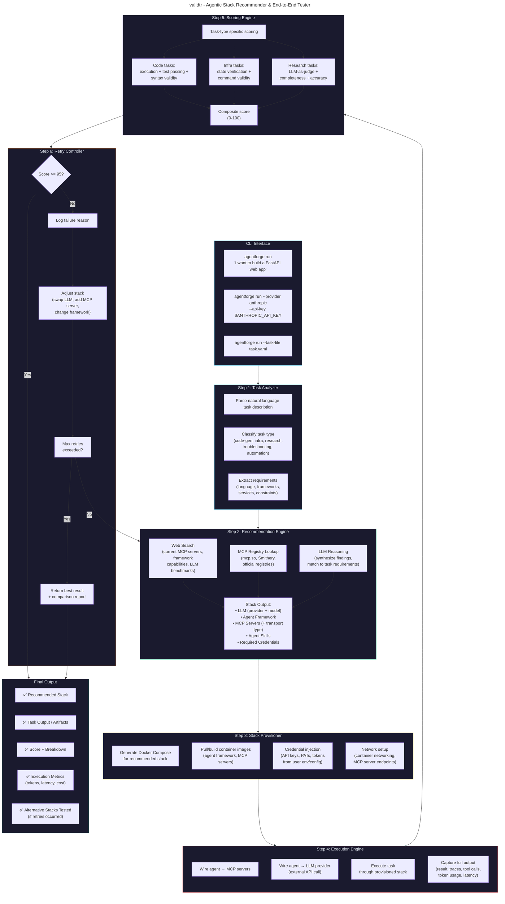

# validtr

```mermaid
---
title: "validtr - Agentic Stack Recommender & End-to-End Tester"
---

flowchart TB
    subgraph CLI["CLI Interface"]
        A1["agentforge run\n'I want to build a FastAPI web app'"]
        A2["agentforge run --provider anthropic\n--api-key $ANTHROPIC_API_KEY"]
        A3["agentforge run --task-file task.yaml"]
    end

    subgraph TaskAnalyzer["Step 1: Task Analyzer"]
        B1["Parse natural language task description"]
        B2["Classify task type\n(code-gen, infra, research,\ntroubleshooting, automation)"]
        B3["Extract requirements\n(language, frameworks,\nservices, constraints)"]
    end

    subgraph RecommendationEngine["Step 2: Recommendation Engine"]
        direction TB
        C1["Web Search\n(current MCP servers, framework\ncapabilities, LLM benchmarks)"]
        C2["MCP Registry Lookup\n(mcp.so, Smithery,\nofficial registries)"]
        C3["LLM Reasoning\n(synthesize findings,\nmatch to task requirements)"]
        C4["Stack Output:\n• LLM (provider + model)\n• Agent Framework\n• MCP Servers (+ transport type)\n• Agent Skills\n• Required Credentials"]
    end

    subgraph Provisioner["Step 3: Stack Provisioner"]
        direction TB
        D1["Generate Docker Compose\nfor recommended stack"]
        D2["Pull/build container images\n(agent framework, MCP servers)"]
        D3["Credential injection\n(API keys, PATs, tokens\nfrom user env/config)"]
        D4["Network setup\n(container networking,\nMCP server endpoints)"]
    end

    subgraph ExecutionEngine["Step 4: Execution Engine"]
        direction TB
        E1["Wire agent → MCP servers"]
        E2["Wire agent → LLM provider\n(external API call)"]
        E3["Execute task\nthrough provisioned stack"]
        E4["Capture full output\n(result, traces, tool calls,\ntoken usage, latency)"]
    end

    subgraph ScoringEngine["Step 5: Scoring Engine"]
        direction TB
        F1["Task-type specific scoring"]
        F2["Code tasks:\nexecution + test passing +\nsyntax validity"]
        F3["Infra tasks:\nstate verification +\ncommand validity"]
        F4["Research tasks:\nLLM-as-judge +\ncompleteness + accuracy"]
        F5["Composite score\n(0-100)"]
    end

    subgraph RetryController["Step 6: Retry Controller"]
        G1{"Score >= 95?"}
        G2["Log failure reason"]
        G3["Adjust stack\n(swap LLM, add MCP server,\nchange framework)"]
        G4["Max retries\nexceeded?"]
        G5["Return best result\n+ comparison report"]
    end

    subgraph Output["Final Output"]
        H1["✅ Recommended Stack"]
        H2["✅ Task Output / Artifacts"]
        H3["✅ Score + Breakdown"]
        H4["✅ Execution Metrics\n(tokens, latency, cost)"]
        H5["✅ Alternative Stacks Tested\n(if retries occurred)"]
    end

    CLI --> TaskAnalyzer
    TaskAnalyzer --> RecommendationEngine
    C1 --> C4
    C2 --> C4
    C3 --> C4
    RecommendationEngine --> Provisioner
    Provisioner --> ExecutionEngine
    ExecutionEngine --> ScoringEngine
    F1 --> F2
    F1 --> F3
    F1 --> F4
    F2 --> F5
    F3 --> F5
    F4 --> F5
    ScoringEngine --> RetryController
    G1 -- "Yes" --> Output
    G1 -- "No" --> G2
    G2 --> G3
    G3 --> G4
    G4 -- "No" --> RecommendationEngine
    G4 -- "Yes" --> G5
    G5 --> Output

    style CLI fill:#1a1a2e,stroke:#63dcff,color:#e2e8f0
    style TaskAnalyzer fill:#1a1a2e,stroke:#63dcff,color:#e2e8f0
    style RecommendationEngine fill:#1a1a2e,stroke:#34d399,color:#e2e8f0
    style Provisioner fill:#1a1a2e,stroke:#fbbf24,color:#e2e8f0
    style ExecutionEngine fill:#1a1a2e,stroke:#f87171,color:#e2e8f0
    style ScoringEngine fill:#1a1a2e,stroke:#a78bfa,color:#e2e8f0
    style RetryController fill:#1a1a2e,stroke:#fb923c,color:#e2e8f0
    style Output fill:#1a1a2e,stroke:#34d399,color:#e2e8f0
```